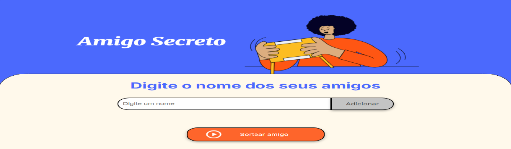

<h1 align="center"> Amigo Secreto </h1>

---

## **Introdução**
* O Amigo Secreto é uma maneira fácil de fazer o seu próximo amigo secreto. 

* Não precisa instalar.

## **Como usar**

Para usar o aplicativo, siga os passos abaixo:

1. Digite o nome de um amigo no campo "Digite um nome".
2. Clique em "adicionar" para incluir o nome na lista.
3. Repita o processo até adicionar todos os amigos.
4. Clique em "Sortear amigo" para revelar o resultado.
5. Para um novo sorteio atualize a página.

## **Acesse o Projeto**
O Amigo Secreto não precisa ser instalado, basta acessar o link abaixo:

[Amigo Secreto](https://amigosecreto-lyart.vercel.app/)

## **Tecnologias Usadas**

Este projeto foi desenvolvido com as seguintes tecnologias:

* **HTML:** Para a estrutura da página.
* **CSS:** Para o design e estilização.
* **JavaScript:** Para a lógica do sorteio.

## Contribuições

Este projeto é um exercício pessoal para meu portfólio. No momento, não estou aceitando contribuições externas, mas sinta-se à vontade para usá-lo ou dar um "fork". Se tiver alguma dúvida, pode abrir uma "issue".

## Autor e Créditos

Este projeto foi desenvolvido por **[Ícaro](https://github.com/icaromcbrain/challenge-amigo-secreto)** como parte do programa de formação **ONE (Oracle Next Education)**, em parceria com a **Alura**.

